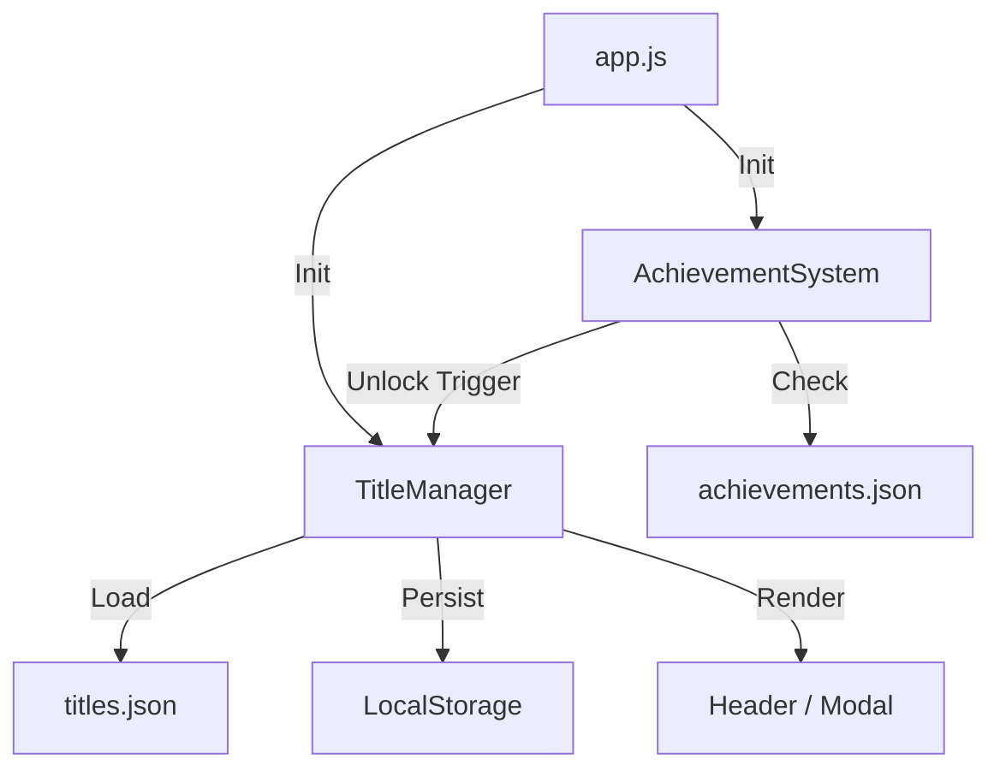

# 基本設計: 称号・二つ名システム

## 1. アーキテクチャ概要
`TitleManager` モジュールを新設し、称号データの管理、永続化、UI制御を集約する。
`AchievementSystem` は実績解除イベントのトリガーのみを担当し、報酬付与の実行責務は `TitleManager` に委譲する（疎結合あるいは明確な方向性を持つ依存関係）。



## 2. データ構造

### 2.1. 称号定義 (`js/data/titles.json`)
称号のマスターデータ。PrefixとSuffixを別々の配列で管理する。

```json
{
  "prefixes": [
    { "id": "p_beginner", "text": "駆け出しの" },
    { "id": "p_legendary", "text": "伝説の" }
  ],
  "suffixes": [
    { "id": "s_trainee", "text": "見習い" },
    { "id": "s_squatter", "text": "スクワッター" }
  ]
}
```

### 2.2. 実績データ拡張 (`js/data/achievements.json`)
実績定義に `rewards` フィールドを追加し、解除時に獲得できる称号IDを指定する。

```json
{
  "id": "reps-100",
  // ...既存フィールド...
  "rewards": {
    "titlePrefix": "p_beginner",
    "titleSuffix": "s_trainee"
  }
}
```

### 2.3. 永続化データ (`localStorage`)
キー: `squat-tracker-titles`

```json
{
  "unlockedPrefixes": ["p_beginner", "p_initial_01"],
  "unlockedSuffixes": ["s_trainee", "s_initial_01"],
  "currentPrefix": "p_beginner",
  "currentSuffix": "s_trainee"
}
```

## 3. クラス設計 (TitleManager)

### 責務
- 称号データのロードとキャッシュ
- 解除済み称号の管理と永続化
- 現在装備中の称号の管理と永続化
- UI（ヘッダー表示、設定モーダル）のレンダリング

### API仕様
```javascript
const TitleManager = {
  data: { prefixes: [], suffixes: [] },
  state: { unlockedPrefixes: [], unlockedSuffixes: [], currentPrefix: null, currentSuffix: null },

  // 初期化: データロード、localStorage読み込み、初期表示更新
  init(titlesData),

  // 称号獲得: 実績システムから呼ばれる
  // prefixId/suffixId は null の場合もある
  unlock(prefixId, suffixId),

  // 称号装備: UIから呼ばれる
  equip(prefixId, suffixId),

  // UI更新: ヘッダーの称号表示を更新
  updateDisplay(),

  // モーダル表示: 設定画面を開く
  openSettingsModal(),

  // 永続化: stateをlocalStorageに保存
  save(),

  // ロード: localStorageからstateを復元
  load()
};
```

## 4. UI設計

### 4.1. ヘッダー表示
既存の `<p class="eyebrow">` 要素を動的に書き換える。
ID: `user-title-display`

### 4.2. 設定モーダル
既存の `modal` クラス構造を再利用または複製して実装。

**構成要素:**
- **プレビューエリア**: 現在選択中の組み合わせを表示。
- **Prefix選択リスト**: 解除済みは選択可能、未解除はグレーアウト。
- **Suffix選択リスト**: 同上。
- **保存ボタン**: 変更を確定して閉じる。

### 4.3. 実績画面連携
実績タブ (`#tab-achievements`) の上部、または設定カード (`.control-card`) に「称号設定」ボタンを配置する。
今回はアクセスの良さを考慮し、**実績タブ内（バッジグリッドの上）** に配置する。

## 5. 処理フロー

### 5.1. アプリ起動時
1. `app.js` が `titles.json` をフェッチ。
2. `TitleManager.init(data)` を呼び出し。
3. `localStorage` から保存データをロード。
4. ヘッダーの表示を更新。

### 5.2. 実績解除時
1. `AchievementSystem.check()` が条件達成を検知。
2. `AchievementSystem` が `achievements.json` の `rewards` を確認。
3. `rewards` があれば `TitleManager.unlock(pId, sId)` をコール。
4. `TitleManager` が `unlocked` リストに追加し、保存。
5. Toast通知で「称号獲得: [称号名]」を表示（`AchievementSystem` または `TitleManager` が担当）。

### 5.3. 称号変更時
1. ユーザーが「称号設定」ボタンを押下 -> モーダル開く。
2. リストからPrefix/Suffixを選択 -> プレビュー更新。
3. 「保存」押下 -> `TitleManager.equip()` -> 保存 -> ヘッダー更新 -> モーダル閉じる。
